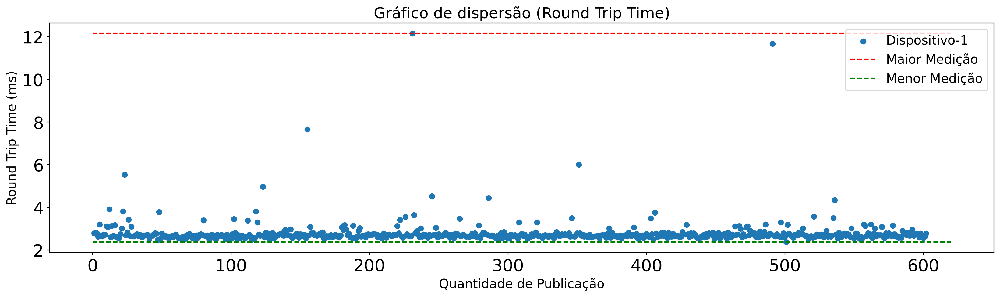
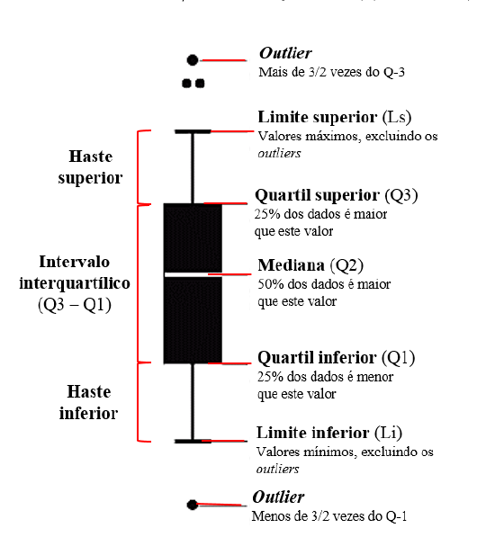
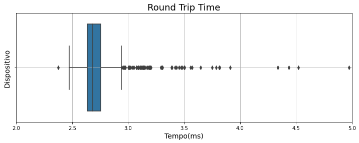
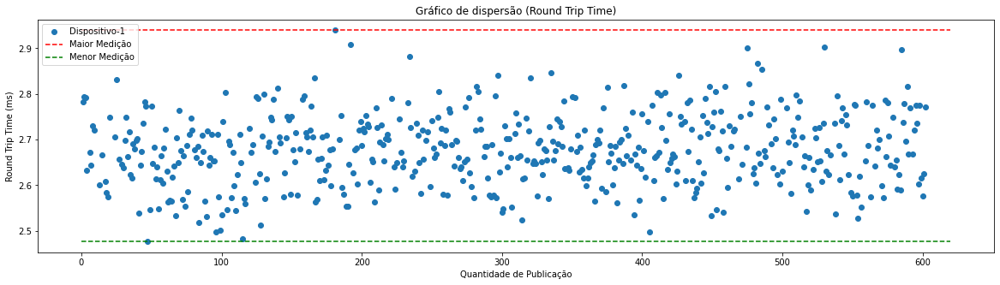
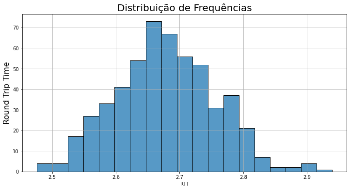

## Objetivo

Nessa sessão irei olhar os dados e fazer alguns tratamentos necessários para uma boa análise.
Começarei analisando um gráfico de dispersão referente a nossa amostra capturada na sessão passada.
Nesse sessão pretendo mostrar mais um estudo em cima dos dados, focando menos em códigos que foram utilizados para essas análises.

Os códigos que foram utilizados e os dados que estão sendo estudados nessa sessão, podem ser encontrados no diretório `Data_analytics/device-1-sizepayload-6-msg-600`.

Segue abaixo uma tabela contendo informação que foram utilizadas desse diretório.

| Info             | link                                                                                                                                                       |
| ---------------- | ---------------------------------------------------------------------------------------------------------------------------------------------------------- |
| Dados            | [data.csv](https://github.com/joaogabriel1995/analise-desempenho-mqtt-iot./blob/main/Data_analytics/device-1-sizepayload-6-msg-600/data.csv)               |
| Código Relatório | [relatorio.ipynb](https://github.com/joaogabriel1995/analise-desempenho-mqtt-iot./blob/main/Data_analytics/device-1-sizepayload-6-msg-600/relatorio.ipynb) |

## Dispersão da Amostra

Vamos analisar como os nossos dados estão distribuidos.

$$
média = 2.7945
$$

$$
mediana = 2.6867
$$

Sabemos que a média é uma medida de tendência central que leva em consideração todos os valores de uma amostra o que é algo positivo. No entanto, como a média é sensivel a cada valor, valores extremos pode afeta-la de maneira consideravel. A média acaba não resistindo a valores extremos, portanto podemos dizer que a média não é uma medida de centro resistente. Quando nossa mediana é menor que nossa média indica uma assimetria para direita, ou seja, poucos valores de magnitude alta estão aumentando o valor da nossa média, podendo esses serem valores que são considerados outliers.

###

Analisando Dados Discrepantes(Outliers).

Analisando o gráfico acima pode-se perceber que existem dados discrepantes, esses dados são conhecidos como outliers, que são dados que diferenciam drasticamente de todos os outros.

Em outras palavras, um outlier é um valor que foge da normalidade e que pode causar anomalias nos resultados obtidos por meio de algoritmos e sistemas de análise.

Vamos analisar um gráfico que é denominado boxPlot e depois utilizaremos uma regra para limpar os outliers.

O grande objetivo é verificar a distribuição dos dados. Assim, as conclusões que tiramos ao analisar um box plot são: centro dos dados (a média ou mediana), a amplitude dos dados (máximo – mínimo), a simetria ou assimetria do conjunto de dados e a presença de outliers.

Segue uma imagem abaixo que representa um boxplot. Iremos utilizar um conceito estatistico denominado intervalos interquartils

Uma regra bastante usada afirma que um dado é um outlier quando ele é maior que $1{,}5\cdot \text{FIQ}$ acima do terceiro quartil ou abaixo do primeiro quartil.

$$ {FIQ} = {Q}_3 - {Q}_{1} $$

$$
LimiteInferior = {Q}_{1} - 1,5.{FIQ}
$$

$$
LimiteSuperior = {Q}_{3} + 1,5.{FIQ}
$$

Segue abaixo o gráfico boxplot referente aos nossos dados.

Todos os valores foram calculados no código, aqui irei apenas apresentar os resultados já calculados.

$$
LimiteSuperior = 2.9426
$$

$$
LimiteInferior = 2.4481
$$

Podemos considerar valores acima desses parametros, como valores discrepantes dos nossos dados.

Agora irei apresentar um gráfico após a limpeza dos outliers.

Após todas as limpezas iremos calcular nossa média novamente e ver qual impacto essa limpeza de dados gerou em nossa média.

$$
média = 2.6776
$$

$$
mediana = 2.6763
$$

